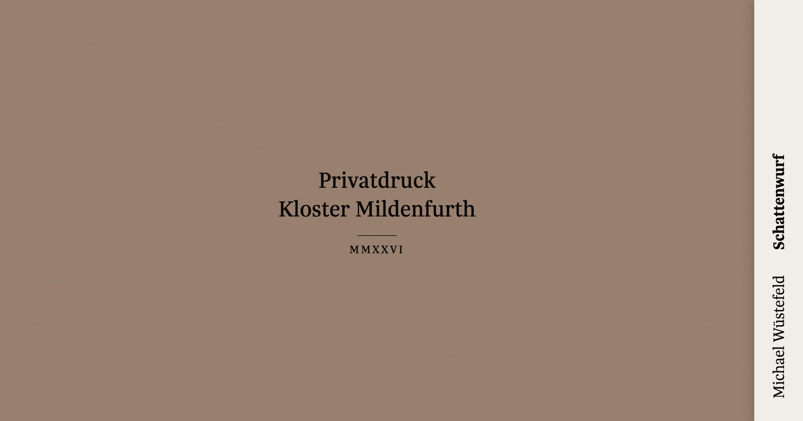

[](https://github.com/johannschopplich/privatdruck-mildenfurth)

# Privatdruck Mildenfurth

Annual private printing of contemporary German poetry for the Arbeitskreis Kunst und Kultur am Kloster Mildenfurth – one markdown file per year, one PDF out, set after Bringhurst's _Elements_.

## Why

Since 2003 the Arbeitskreis Kunst und Kultur am Kloster Mildenfurth has published one slim volume of contemporary German poetry each year – fifty numbered copies, handed out at a reading in the cloister garden. Edited by Sebastian Schopplich; for two decades advised by Wulf Kirsten, until his death in 2022.

I took over the typesetting from a Word-based layout in 2026 and rebuilt production around the stack below. The constraint is Bringhurst's _Elements of Typographic Style_: every choice the book makes has a reason on a page somewhere.

## Typographic principles

- **Fonts** – Sirba (body), Trola (display)
- **Page** – modified Tschichold canon; inner < top < outer < bottom
- **Rhythm** – every vertical gap a multiple of one body line
- **Caps** – always letterspaced
- **Figures** – oldstyle; folios tabular oldstyle
- **Punctuation** – hanging at line starts and ends
- **Apparatus** – source notes set close under their poem
- **Folios** – book block counted from the title page

## How it's built

- [Nuxt 4](https://nuxt.com) + [@nuxt/content](https://content.nuxt.com) – markdown → routes
- [Tailwind v4](https://tailwindcss.com) – design tokens, utility classes
- [CSS Paged Media](https://developer.mozilla.org/en-US/docs/Web/CSS/CSS_paged_media) – `@page` rules, folio positioning, custom counters
- [Playwright](https://playwright.dev) – Chromium headless, prints the route to PDF

```bash
pnpm install
pnpm dev              # preview in the browser
pnpm export [year]    # render exports/<year>.pdf (default: newest year)
```

## Yearly workflow

One file per year under `content/books/{year}.md`. Frontmatter for metadata, MDC components for the body:

```markdown
---
year: 2026
authorFirst: Michael
authorLast: Wüstefeld
authorGender: m
title: Schattenwurf
copies: 50
editor: Sebastian Schopplich
sequenceOrdinal: Zwanzigster
---

::poem{title="Altes Lied" date="1985"}
Wer spricht hier von Gestern
Dreht sich sehnsüchtig um
…
::

::note
(Erstveröffentlichung: …)
::
```

`pnpm export 2026` renders the book to `exports/2026.pdf`. That's the whole pipeline.

## License

[MIT](./LICENSE) License © 2026-PRESENT [Johann Schopplich](https://github.com/johannschopplich)
